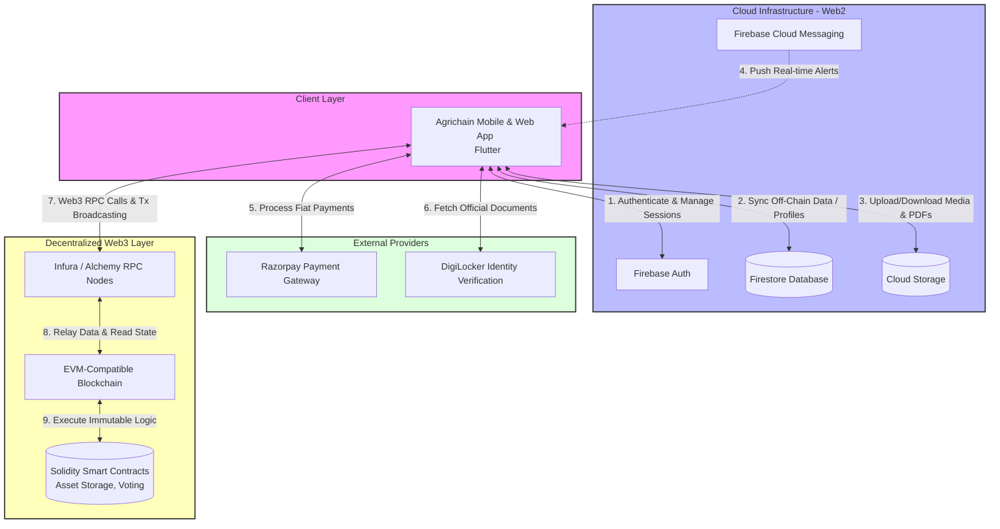
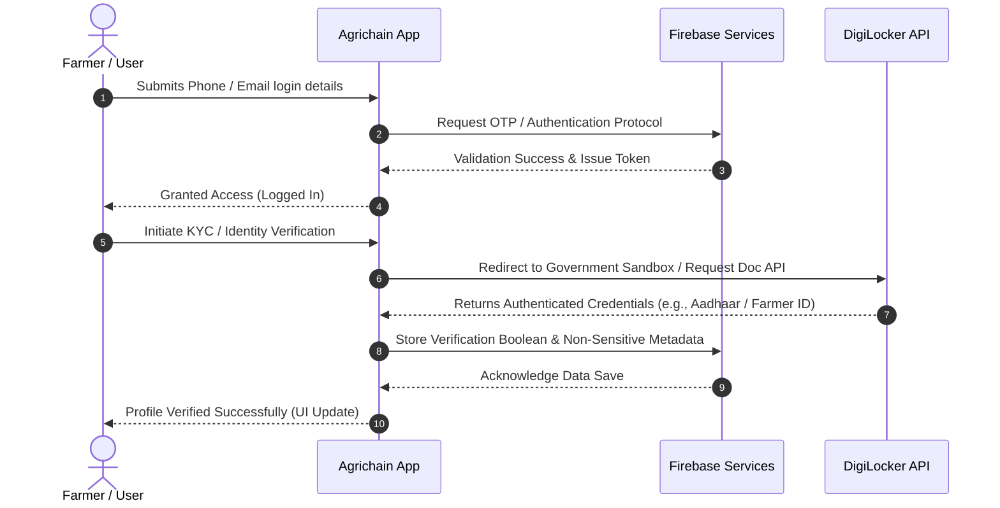
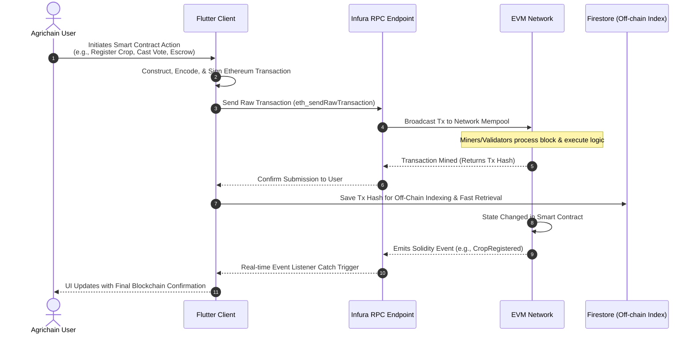

# Agrichain: Comprehensive Architecture & Workflow Documentation

This document provides an in-depth, presentation-ready overview of the **Agrichain** platform, detailing the technology stack, system architecture, component interactions, and execution workflows. It is designed to be easily incorporated into pitch decks or technical presentations.

---

## 1. Executive Summary & Technology Stack

Agrichain is a decentralized agricultural platform integrating mobile interfaces with both Web2 cloud services and Web3 blockchain networks.

### Frontend Application
- **Framework**: Flutter (Dart)
- **Platforms Supported**: Android, iOS, Web, Desktop
- **Purpose**: Provides a seamless, cross-platform user interface for farmers, buyers, and administrators.

### Backend & Cloud Infrastructure (Web2)
- **Firebase Authentication**: Secure user onboarding and session management.
- **Firebase Firestore**: Scalable NoSQL real-time database for storing off-chain metadata (profiles, crop listings, activity logs).
- **Firebase Cloud Storage**: Secure object storage for media and verification documents (e.g., PDFs, crop images).
- **Firebase Cloud Messaging (FCM)**: Real-time push notifications for transaction updates and alerts.

### Blockchain & Smart Contracts (Web3)
- **Network**: EVM-Compatible Blockchain (Ethereum / Polygon).
- **Smart Contracts**: Written in Solidity (e.g., `Ballot.sol`, `Storage.sol`, `Owner.sol`) to handle decentralized voting, asset storage, and role-based access control.
- **Provider Layer**: Infura / Alchemy acts as the RPC gateway between the mobile app and the blockchain.
- **Integration Libraries**: `ethers.js` / `web3.js` utilized in deployment and interaction scripts.

### Third-Party API Integrations
- **Razorpay**: Fiat payment gateway for processing traditional financial transactions.
- **DigiLocker**: Integrated for official KYC (Know Your Customer) and secure farmer credential verification.

---

## 2. Global System Architecture

*Use this diagram to illustrate the overall system topology to stakeholders.*



---

## 3. Detailed Execution Workflows

### A. User Onboarding & KYC Workflow
This sequence diagram details how a new user securely registers and verifies their identity using DigiLocker.



**Key Steps:**
1. User logs in via **Firebase Authentication**.
2. App triggers the **DigiLocker** integration flow.
3. User authorizes access to their official documents.
4. The application analyzes the credentials and securely stores the **"Verified"** boolean flag and basic metadata in **Firestore**.

### B. Smart Contract & Decentralized Transaction Workflow
This diagram explains how the Agrichain app interacts with the blockchain for immutable record-keeping and execution.



**Key Steps:**
1. **Transaction Construction**: The Flutter app formats a transaction payload using integrated Dart Web3 libraries.
2. **Broadcasting**: The encrypted, signed transaction is pushed to the network via the **Infura RPC** endpoint.
3. **Execution**: The EVM processes the instructions defined in our Solidity smart contracts.
4. **Off-Chain Indexing**: The resulting Transaction Hash is saved in Firebase Firestore, allowing fast front-end queries without relying entirely on slower blockchain reads.
5. **Event Confirmation**: Solidity events are broadcast, caught by the application, and used to dynamically refresh the UI.

### C. Traditional Fiat Payment Workflow
For processing non-crypto transactions via Razorpay.

**Workflow Steps:**
1. User selects a premium service, fee, or physical product requiring a fiat payment.
2. App requests a unique Payment Order ID from the backend securely.
3. Razorpay SDK opens the checkout UI within the Flutter application.
4. User completes the payment via UPI, Credit/Debit Cards, or Netbanking.
5. Razorpay processes the transaction and returns a cryptographically signed Payment Success token.
6. The app verifies the signature, fulfills the service, and logs the receipt in Firestore.

---

## 4. Development Operations & Compilation

### App Frontend (Flutter)
- **Local Run**: `flutter run`
- **Android Release Build**: `flutter build apk --release`
- **Web App Compilation**: `flutter build web`

### Smart Contracts (Solidity)
- **Primary IDE**: Remix IDE is the recommended environment for rapid iteration and testing within this monorepo.
- **Local Deployment Scripts**: Alternatively, deploy via command line using the provided Node.js/TypeScript scripts.
  ```bash
  npx ts-node scripts/deploy_with_ethers.ts
  ```
- **Automated Testing**: 
  - Standard tests located in `tests/`.
  - Framework supports both Solidity native testing (`Ballot_test.sol`) and JavaScript-based unit tests (`storage.test.js` using Mocha/Chai).
