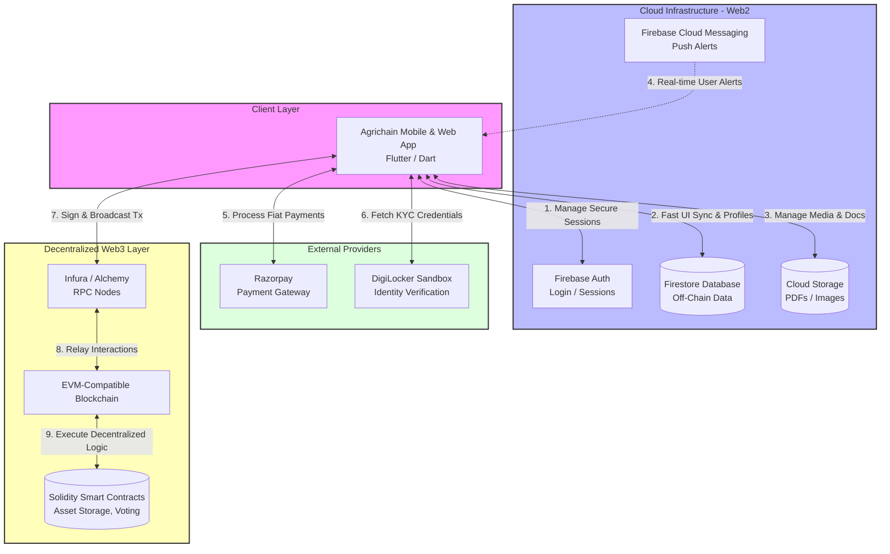

# Agrichain: Tech Stack & System Workflow

This document provides a concise overview of the technologies used in the Agrichain platform, accompanied by a global architectural flowchart ideal for presentation slides.

---

## 1. Technology Stack

### App & Frontend
- **Flutter / Dart**: Cross-platform mobile (Android, iOS), web, and desktop application framework.

### Backend & Cloud Services (Web2)
- **Firebase Authentication**: User identity and secure session management.
- **Firebase Firestore**: Scalable NoSQL real-time database for off-chain metadata.
- **Firebase Cloud Storage**: Secure object storage for media and verification documents (PDFs, crop images).
- **Firebase Cloud Messaging (FCM)**: Real-time push notifications.

### Blockchain & Smart Contracts (Web3)
- **EVM-Compatible Blockchain**: Network (Ethereum / Polygon) for executing decentralized logic.
- **Solidity**: Smart contract language used for `Ballot`, `Storage`, and `Owner` contracts.
- **Remix IDE**: Fast compilation and testing environment.
- **RPC Providers**: Infura / Alchemy acting as the gateway between the app and the EVM.
- **Ethers.js / Web3.js**: JavaScript libraries for broadcasting transactions.

### Third-Party APIs
- **Razorpay**: Fiat payment gateway for processing traditional financial transactions.
- **DigiLocker**: Integrated for official KYC (Know Your Customer) and credential verification.

---

## 2. Global System Workflow Diagram

*This diagram illustrates the multi-layered interactions between the Client App, Web2 Cloud Services, Web3 Blockchain Services, and External APIs.*

