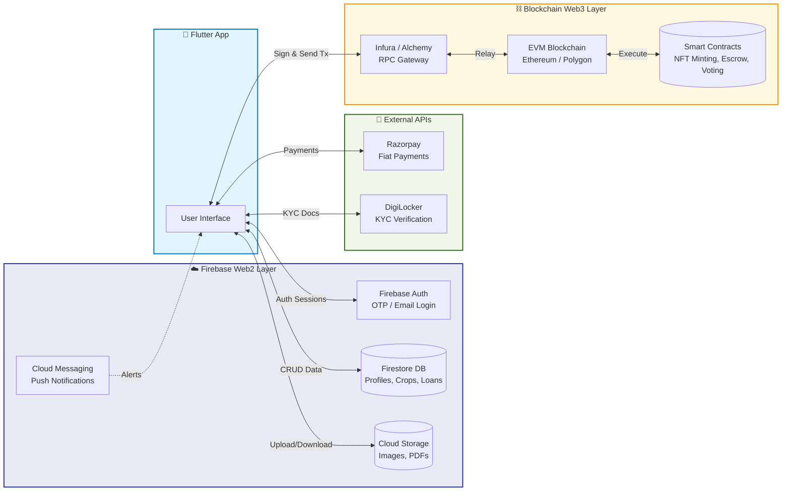

# AgriChain: Complete Project Flowchart (Both Users)

This document contains a **full end-to-end flowchart** for the AgriChain platform, covering both user journeys — **Farmer/Seller** and **Buyer** — from app launch to every major feature.

---

## 1. Complete Application Flow — Both Users

```mermaid
flowchart TD
    %% ===== ENTRY POINT =====
    Start([🚀 App Launch]) --> Init[Initialize Firebase & App Services]
    Init --> FirstTime{First Time User?}

    FirstTime -->|Yes| Onboard[📱 Onboarding Screens<br>Welcome, Features, Get Started]
    FirstTime -->|No| AuthCheck

    Onboard --> AuthCheck{User Authenticated?}

    AuthCheck -->|No| Login[🔐 Login / Signup Screen]
    AuthCheck -->|Yes| LoadProfile[Load User Profile from Firestore]

    Login --> AuthMethod{Auth Method}
    AuthMethod --> PhoneAuth[Phone OTP via Firebase Auth]
    AuthMethod --> EmailAuth[Email & Password via Firebase Auth]
    PhoneAuth --> SignUp
    EmailAuth --> SignUp

    SignUp[📝 Signup Screen<br>Name, Email, Phone] --> RoleSelect{Select User Role}

    RoleSelect -->|Farmer / Seller| ProfileSetupF[🧑‍🌾 Farmer Profile Setup<br>Farm Details, Location, Aadhaar]
    RoleSelect -->|Buyer| ProfileSetupB[🛒 Buyer Profile Setup<br>Business Name, GST, Location]

    ProfileSetupF --> KYC[🪪 KYC Verification<br>DigiLocker Integration]
    ProfileSetupB --> KYC

    KYC --> DigiLocker[DigiLocker Sandbox API<br>Fetch Aadhaar / Farmer ID]
    DigiLocker --> StoreKYC[Store Verified Status in Firestore]
    StoreKYC --> LoadProfile

    LoadProfile --> RoleRoute{User Type?}

    %% ===========================
    %% FARMER / SELLER JOURNEY
    %% ===========================
    RoleRoute -->|Farmer / Seller| FarmerHome

    subgraph FarmerJourney ["🧑‍🌾 FARMER / SELLER JOURNEY"]
        direction TB

        FarmerHome[🏠 Home Dashboard<br>Overview, Stats, Quick Actions]

        FarmerHome --> FMyCrops[🌾 My Crops<br>View Listed Crops]
        FarmerHome --> FLoans[🏦 Loans]
        FarmerHome --> FMarket[🛒 Marketplace]
        FarmerHome --> FContracts[📄 Contracts & Downloads]
        FarmerHome --> FProfile[👤 Profile]

        %% --- My Crops Sub-flow ---
        FMyCrops --> AddCrop[➕ Add New Crop<br>Name, Quantity, Price, Images]
        AddCrop --> UploadImg[Upload Crop Images<br>Firebase Cloud Storage]
        UploadImg --> SaveCropDB[Save Crop Listing<br>to Firestore]
        SaveCropDB --> MintCropNFT{Mint as NFT?}
        MintCropNFT -->|Yes| CropNFT[🔗 Mint Crop NFT<br>On-Chain via Smart Contract]
        CropNFT --> BroadcastTx1[Sign & Broadcast Tx<br>via Infura RPC]
        BroadcastTx1 --> SaveTxHash1[Save Tx Hash in Firestore]
        MintCropNFT -->|No| FMyCrops

        %% --- Loans Sub-flow ---
        FLoans --> ApplyLoan[📋 Apply for Loan<br>Amount, Purpose, Duration]
        ApplyLoan --> LoanKYCCheck{KYC Verified?}
        LoanKYCCheck -->|No| KYCPrompt1[Prompt KYC Verification]
        LoanKYCCheck -->|Yes| SubmitLoan[Submit Loan Application<br>to Firestore]
        SubmitLoan --> LoanStatus[Track Loan Status<br>Pending → Approved → Disbursed]
        LoanStatus --> LoanContract[📄 Generate Loan Agreement PDF]
        LoanContract --> DownloadPDF1[Download / View Contract]

        %% --- Marketplace Sub-flow (Farmer) ---
        FMarket --> ViewListings[Browse All Crop Listings]
        ViewListings --> SellCrop[List Crop for Sale<br>Set Price & Terms]
        SellCrop --> ReceiveOffer[Receive Purchase Offers<br>from Buyers]
        ReceiveOffer --> NegotiateF{Accept / Reject?}
        NegotiateF -->|Accept| GenerateContract[📄 Generate Sale Contract PDF]
        GenerateContract --> SmartContractExec[Execute Sale on Blockchain<br>Smart Contract Escrow]
        SmartContractExec --> PaymentReceived[💰 Receive Payment<br>via Razorpay]
        NegotiateF -->|Reject| ViewListings

        %% --- Contracts Sub-flow ---
        FContracts --> ViewContracts[View All Contracts<br>Sale Agreements, Loan Docs]
        ViewContracts --> DownloadDoc[Download PDF Documents<br>from Cloud Storage]

        %% --- Profile Sub-flow ---
        FProfile --> EditProfile[✏️ Edit Profile<br>Name, Photo, Farm Details]
        FProfile --> WalletConnect[🔗 Connect Crypto Wallet<br>MetaMask / WalletConnect]
        WalletConnect --> WalletLinked[Wallet Address Linked<br>to Firestore Profile]
        FProfile --> MintLandNFT[🏞️ Mint Land NFT<br>Tokenize Land Records]
        MintLandNFT --> BroadcastTx2[Sign & Broadcast Tx<br>via Infura RPC]
        BroadcastTx2 --> SaveTxHash2[Save Tx Hash in Firestore]
        FProfile --> ViewRatings[⭐ View Ratings & Reviews]
        FProfile --> TransactionHistory[📊 Transaction History]
    end

    %% ===========================
    %% BUYER JOURNEY
    %% ===========================
    RoleRoute -->|Buyer| BuyerMarket

    subgraph BuyerJourney ["🛒 BUYER JOURNEY"]
        direction TB

        BuyerMarket[🏪 Marketplace<br>Browse & Search Crops]

        BuyerMarket --> BWallet[💳 Wallet]
        BuyerMarket --> BProfile[👤 Profile]
        BuyerMarket --> BLoans[🏦 Loans]
        BuyerMarket --> BContracts[📄 Contracts & Downloads]
        BuyerMarket --> BAnalytics[📊 Analytics]

        %% --- Marketplace Sub-flow (Buyer) ---
        BuyerMarket --> SearchCrops[🔍 Search & Filter Crops<br>By Type, Price, Location]
        SearchCrops --> ViewCropDetail[View Crop Details<br>Images, Seller Info, Price]
        ViewCropDetail --> PlaceOrder{Place Order?}
        PlaceOrder -->|Yes| PaymentFlow[💳 Payment via Razorpay<br>UPI / Card / Netbanking]
        PaymentFlow --> RazorpaySDK[Razorpay SDK Checkout]
        RazorpaySDK --> VerifyPayment[Verify Payment Signature]
        VerifyPayment --> SaleContract[📄 Generate Sale Agreement PDF]
        SaleContract --> BlockchainRecord[Record Sale on Blockchain<br>Smart Contract Execution]
        BlockchainRecord --> BroadcastTx3[Sign & Broadcast Tx<br>via Infura RPC]
        BroadcastTx3 --> SaveTxHash3[Save Tx Hash in Firestore]
        SaveTxHash3 --> PushNotif[🔔 Push Notification<br>to Seller via FCM]
        PlaceOrder -->|No| SearchCrops

        %% --- Wallet Sub-flow ---
        BWallet --> ViewBalance[View Wallet Balance<br>& Connected Address]
        ViewBalance --> WalletTxHistory[View On-Chain<br>Transaction History]
        BWallet --> ConnectWallet[🔗 Connect Wallet<br>MetaMask / WalletConnect]

        %% --- Profile Sub-flow ---
        BProfile --> BEditProfile[✏️ Edit Profile<br>Name, Photo, Business Info]
        BProfile --> BViewRatings[⭐ Ratings & Reviews]
        BProfile --> BKYCStatus[KYC Verification Status]

        %% --- Loans Sub-flow (Buyer) ---
        BLoans --> BApplyLoan[📋 Apply for Loan]
        BApplyLoan --> BLoanSubmit[Submit to Firestore]
        BLoanSubmit --> BLoanTrack[Track Loan Status]
        BLoanTrack --> BLoanDoc[📄 Loan Agreement PDF]

        %% --- Contracts Sub-flow ---
        BContracts --> BViewContracts[View Purchase Contracts<br>& Loan Documents]
        BViewContracts --> BDownloadPDF[Download PDF Documents]

        %% --- Analytics Sub-flow ---
        BAnalytics --> SpendingCharts[📈 Spending Analytics<br>Charts & Graphs]
        BAnalytics --> PurchaseHistory[Purchase History<br>& Trends]
        BAnalytics --> MarketInsights[Market Price Insights]
    end

    %% ===========================
    %% STYLING
    %% ===========================
    style Start fill:#4CAF50,stroke:#333,color:#fff,stroke-width:2px
    style FarmerJourney fill:#E8F5E9,stroke:#2E7D32,stroke-width:3px,color:#1B5E20
    style BuyerJourney fill:#E3F2FD,stroke:#1565C0,stroke-width:3px,color:#0D47A1
    style Login fill:#FFF3E0,stroke:#E65100,stroke-width:2px
    style KYC fill:#F3E5F5,stroke:#6A1B9A,stroke-width:2px
    style RoleSelect fill:#FFFDE7,stroke:#F57F17,stroke-width:2px
```

---

## 2. Backend System Flow (What Happens Behind the Scenes)

---

## 3. Quick Reference — Feature Comparison

| Feature | 🧑‍🌾 Farmer/Seller | 🛒 Buyer |
|---|---|---|
| **Home/Landing** | Dashboard with stats & quick actions | Marketplace (browse crops) |
| **Crops** | Add, manage & list crops for sale | Search, filter & purchase crops |
| **NFT Minting** | Mint Crop NFT, Mint Land NFT | — |
| **Wallet** | Connect wallet via Profile | Dedicated Wallet screen |
| **Loans** | Apply & track loan status | Apply & track loan status |
| **Payments** | Receive payments (Razorpay) | Make payments (Razorpay) |
| **Contracts** | Sale agreements, Loan docs (PDF) | Purchase contracts, Loan docs (PDF) |
| **Analytics** | — | Spending charts & market insights |
| **Profile** | Edit, KYC, ratings, tx history | Edit, KYC, ratings |
| **Blockchain** | Crop/Land NFTs, Sale execution | Purchase recording on-chain |
| **Notifications** | Receive buyer order alerts (FCM) | Receive confirmation alerts (FCM) |
